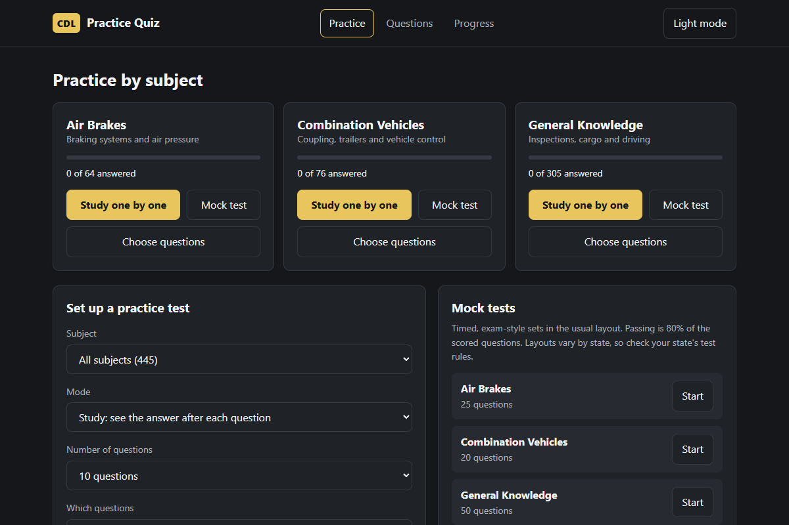
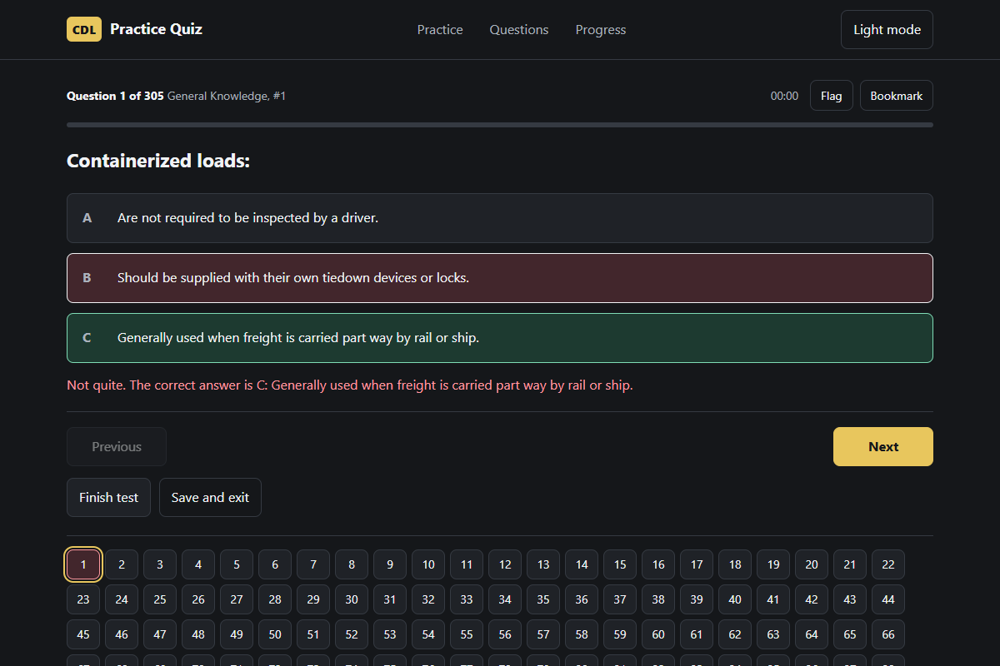

# CDL Practice Quiz

A free practice test for the commercial driver's license (CDL) written exam.
It covers **air brakes**, **combination vehicles**, and **general knowledge**, with 445 questions in total.

- It runs in your web browser.
- It works offline after you download it.
- No ads, no sign-up, no tracking.

## Screenshots





## Start in 3 steps

1. **Download** `CDL-Practice-Quiz.html` from this repository. On GitHub, click the file, then click the **Download raw file** button (the arrow pointing down).
2. **Double-click** the file. It opens in your browser.
3. **Click "Study one by one"** under the subject you want, for example General Knowledge.

That's it. You can use the quiz without installing anything.

## What each part does

| I want to... | Where to click |
| --- | --- |
| Go through one subject in order, one question at a time | **Study one by one** on a subject card |
| Practise with a custom set of questions | **Choose questions** on a card, or the form on the Practice page |
| Take a timed test like the real exam | **Mock test** on a card, or the list under "Mock tests" |
| Find a question or check an answer | **Questions** tab (search, filter, and "Show answers") |
| See how well I'm doing | **Progress** tab |
| Keep my progress safe | **Progress** tab, then **Save backup file** |

### Study mode and exam mode

- **Study mode:** the correct answer shows as soon as you pick one. Use this to learn.
- **Exam mode:** you see your score only at the end. Use this to test yourself.

### Mock tests

Mock tests are timed and use a typical layout:

| Subject | Questions |
| --- | --- |
| Air Brakes | 25 |
| Combination Vehicles | 20 |
| General Knowledge | 50 |

You pass with **80% of the scored questions**. Test layouts and pass marks vary by state, so check your state's rules.

### Keyboard shortcuts during a test

| Key | Action |
| --- | --- |
| 1, 2, 3 | Choose answer A, B, or C |
| Right arrow | Next question |
| Left arrow | Previous question |
| F | Flag or unflag the question (to review it later) |
| S | Bookmark or unbookmark the question |

You can also click the numbered boxes under a test to jump to any question.

## Your progress

- Progress (answers, bookmarks, flags, and past tests) is saved **in your browser on this device only**.
- If you clear your browser data or use a private window, progress is lost.
- To keep it or move it to another computer, go to the **Progress** tab and click **Save backup file**. On the other computer, click **Load backup file**.
- **Erase all progress** deletes everything. This cannot be undone.

## Light and dark mode

Click the **Light mode** or **Dark mode** button at the top right.

## Question notes

- Questions and answers come from three study files. The answers are the ones marked in those files.
- Exact repeats were removed, keeping one copy.
- Some text left over from editing the study files was rewritten so it reads clearly. The meaning was kept.
- Two questions have no marked answer. They are shown but not scored.
- Two pairs of questions have **conflicting marked answers** in the source. Both are kept as they are until someone checks them against the official manual:
  - "When coupling, the proper position of the fifth wheel is" (`combination-vehicles-60` and `combination-vehicles-76`)
  - "Off-ramp that curves downhill" (`general-knowledge-76` and `general-knowledge-132`)

If you spot a mistake, please open an issue on GitHub.

## For developers

### Files

| File | What it does |
| --- | --- |
| `CDL-Practice-Quiz.html` | The whole app in one file. Use this one to run it. |
| `index.html`, `style.css`, `app.js`, `store.js` | The same app, split into separate files for editing |
| `questions.js` | The question bank, one question per line |
| `store.js` | Saves progress in the browser and handles backup files |
| `build.js` | Rebuilds `CDL-Practice-Quiz.html` from the separate files |
| `tests/check-questions.js` | Checks the question bank for broken entries |
| `tests/browser-test.cjs` | Runs the app in a real browser (needs Playwright) |

### Commands

```bash
node tests/check-questions.js   # check the question bank
node build.js                   # rebuild CDL-Practice-Quiz.html
node tests/browser-test.cjs     # run the browser tests (set PLAYWRIGHT_PATH if Playwright is not found)
```

### Privacy by design

The app never sends your data anywhere. A security rule in the page blocks outside connections, and the browser test checks that no outside requests are made.

## License

MIT. See [LICENSE](LICENSE). The license covers the code. The question text comes from the study files the questions were made from.

## Disclaimer

This is practice material, not the official test. Check your state's current CDL manual for the rules that apply to you.
